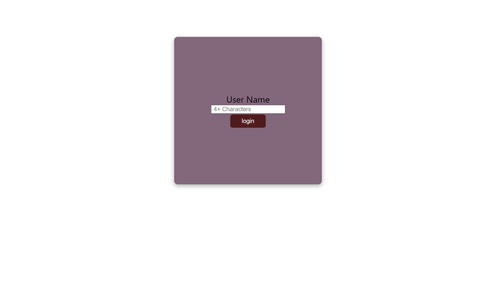
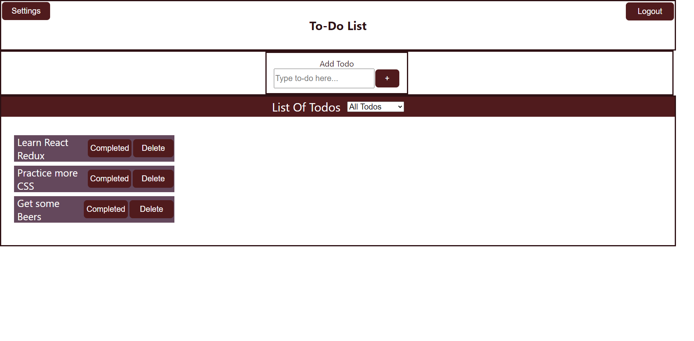
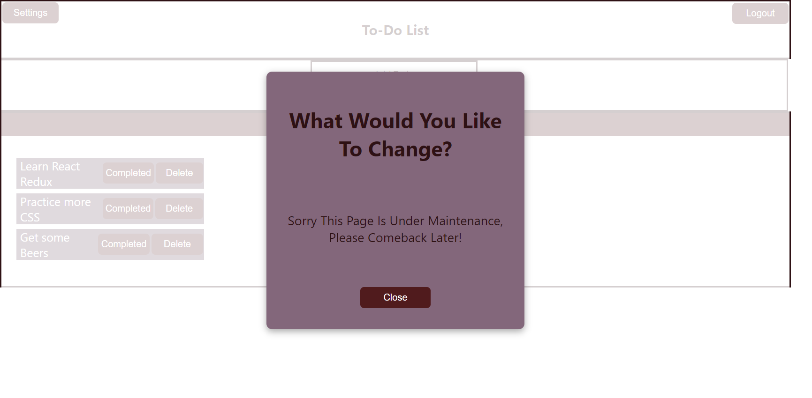

# Todo-App
React app that allows a user to add, remove and keep track to their tasks in an interactive and fun way!

Simply login with a username of at least 5 letters to access the main page, add your todos and mark them as "completed" once your are done.

Then keep track of them by selecting the different options in the drop down menu.

You can also personalise your theme and name through settings.

When finish, press the Logout button to be redirected to the sign in page.

## Preview

SignIn Page

Dashboard

Modal Settings

## Things to be improved

Unfortunately the app is not 100% just yet... but I'm comitted to continue working until resolve the following issues:

&#10060; All To-dos are saved in localStorage but NOT for according to different the user.

&#10060; There is NOT a second theme to choose from.

&#10060; Clicking outside the modal does NOT closes the modal.

&#10060; The application does NOT uses react-redux to store the state.

&#10060; And the styling is very average.. 

